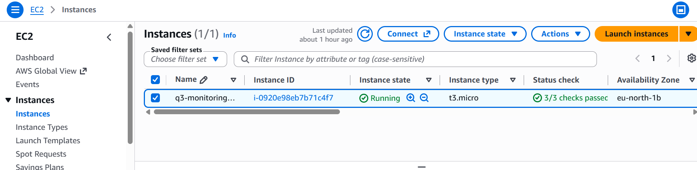
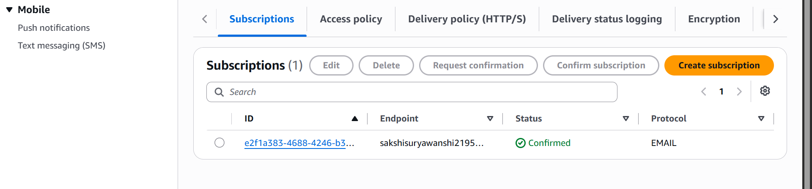
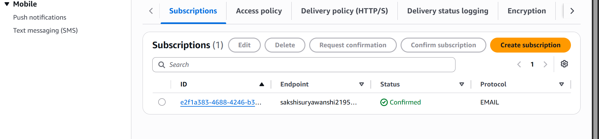
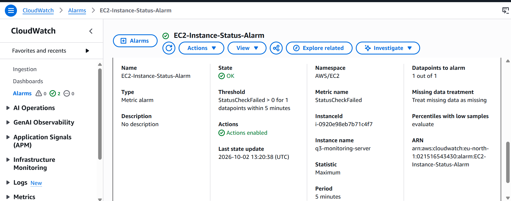
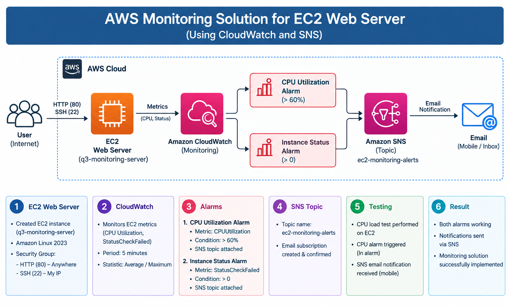
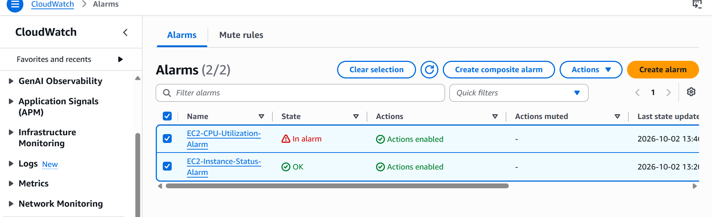
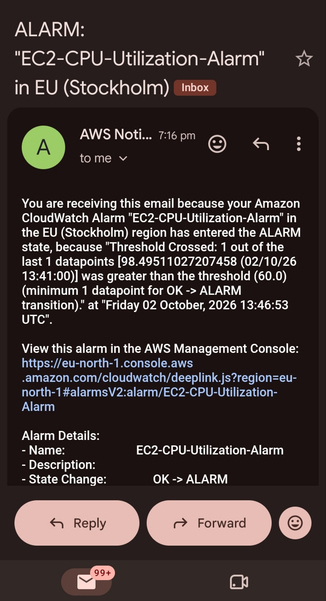
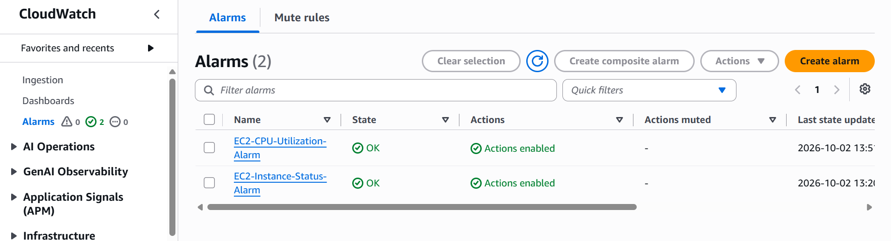

# AWS Monitoring Solution for EC2 Web Server

## 1. Project Title

**AWS Monitoring Solution for an EC2 Web Server using Amazon CloudWatch and Amazon SNS**

---

## 2. Objective

The objective of this project is to create an AWS monitoring solution for an EC2 web server using **Amazon CloudWatch** and **Amazon SNS**.

The project monitors:

* CPU Utilization
* EC2 Instance Status

Two CloudWatch alarms are created and connected to an SNS topic. During testing, the CPU alarm is triggered and an email notification is received.

---

## 3. AWS Services Used

* Amazon EC2
* Amazon CloudWatch
* Amazon SNS

---

# 4. Practical Implementation

## Step 1: Create EC2 Web Server

An EC2 instance was created to act as the web server.

### EC2 Configuration

| Configuration  | Details                |
| -------------- | ---------------------- |
| Instance Name  | `q3-monitoring-server` |
| Instance ID    | `i-0920e98eb7b71c4f7`  |
| AMI            | Amazon Linux 2023      |
| Security Group | `q3-monitoring-sg`     |
| SSH Port       | 22                     |
| HTTP Port      | 80                     |

### Screenshot

---

## Step 2: Create SNS Topic

An Amazon SNS topic named **`ec2-monitoring-alerts`** was created.

An email subscription was added to the topic and the subscription was confirmed.

### SNS Configuration

| Configuration       | Details                 |
| ------------------- | ----------------------- |
| Topic Name          | `ec2-monitoring-alerts` |
| Protocol            | EMAIL                   |
| Subscription Status | Confirmed               |

### Screenshot

---

## Step 3: Create CPU Utilization Alarm

A CloudWatch alarm was created to monitor the CPU utilization of the EC2 instance.

### CPU Alarm Configuration

| Configuration       | Details                     |
| ------------------- | --------------------------- |
| Alarm Name          | `EC2-CPU-Utilization-Alarm` |
| Namespace           | AWS/EC2                     |
| Metric              | CPUUtilization              |
| Instance            | `q3-monitoring-server`      |
| Statistic           | Average                     |
| Period              | 5 minutes                   |
| Threshold           | CPUUtilization > 60%        |
| Datapoints to Alarm | 1 out of 1                  |
| SNS Topic           | `ec2-monitoring-alerts`     |

### Screenshot

---

## Step 4: Create Instance Status Alarm

A second CloudWatch alarm was created to monitor the EC2 instance status.

The **StatusCheckFailed** metric was used for this alarm.

### Instance Status Alarm Configuration

| Configuration       | Details                     |
| ------------------- | --------------------------- |
| Alarm Name          | `EC2-Instance-Status-Alarm` |
| Namespace           | AWS/EC2                     |
| Metric              | StatusCheckFailed           |
| Instance            | `q3-monitoring-server`      |
| Statistic           | Maximum                     |
| Period              | 5 minutes                   |
| Threshold           | StatusCheckFailed > 0       |
| Datapoints to Alarm | 1 out of 1                  |
| SNS Topic           | `ec2-monitoring-alerts`     |

### Screenshot

---

## Step 5: Connect CloudWatch Alarms with SNS

Both CloudWatch alarms were configured to send notifications through the SNS topic:

**`ec2-monitoring-alerts`**

### Architecture Diagram

The monitoring flow is:

**User/Internet → EC2 Web Server → CloudWatch → CloudWatch Alarms → SNS → Email Notification**

---

## Step 6: Test CPU Alarm

CPU utilization was increased on the EC2 server for testing.

The CPU utilization crossed the configured threshold of **60%**, causing the CPU alarm to change to **In Alarm**.

### CPU Alarm Triggered

### SNS Email Notification

After the CPU alarm was triggered, an SNS email notification was received.

---

## Step 7: Final Alarm Status

After testing, the CloudWatch alarms were checked again.

The final status of both alarms was **OK**.

### Final Alarm Status

---

# 5. Testing Result

The monitoring solution was successfully tested.

* CPU Utilization monitoring was configured.
* Instance Status monitoring was configured.
* Two CloudWatch alarms were created.
* Both alarms were connected to the SNS topic.
* The CPU alarm was successfully triggered during testing.
* An SNS email notification was received.
* Final alarm status was checked.

---

# 6. Conclusion

The AWS monitoring solution was successfully implemented using **Amazon EC2, Amazon CloudWatch, and Amazon SNS**.

The EC2 web server was monitored using CPU Utilization and Instance Status metrics. CloudWatch alarms detected the configured conditions and SNS successfully delivered the notification through email.

This demonstrates basic AWS monitoring and alerting for an EC2 web server.
